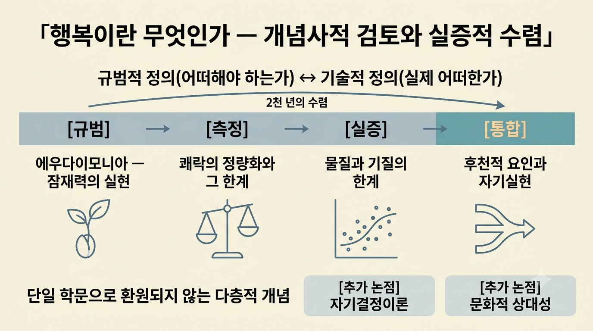

  # GenAI 기초 1 : LLM 기반 업무 자동화

> 동일한 업무 과업(보고서 개요 생성)을 3종 LLM에 투입해 **Claude Opus 4.8**을 선정하고, 그 위에 '개요 설계자' 페르소나와 시스템 프롬프트를 설계한 뒤, 실제 대화로 **문맥 유지·환각 방지**를 검증한 업무 자동화 프롬프트 패키지.

본 문서는 **핵심만 정리한 요약본**이다. 각 항목의 상세 근거·전문·부속 분석은 아래 파일 구조의 원본 문서에 있다.

---

## 파일 구조

```
B1-1/
├── README.md                        ← 요약·색인 (현재 문서)
├── 01_document/                     ← 제출 산출물 3종
│   ├── 1_모델_비교_선정_보고서.md
│   ├── 2_시스템_설계_문서.md
│   └── 3_실행_로그.md
├── 02_source/                       ← 원본 근거 자료
│   ├── B1-1_과제미션.md
│   └── 대화_전문_원본.txt
└── 03_etc/                          ← 보너스 과제
    ├── 4.2_멀티모달_확장.md
    └── 멀티모달_확장.png
``` 

| 파일 | 목적 |
|---|---|
| [**1. 모델 비교·선정 보고서**](01_document/1_모델_비교_선정_보고서.md) | 동일 입력을 3종 모델에 투입해 5개 평가 축·근거로 최종 모델을 선정한 기록 |
| [**2. 시스템 설계 문서**](01_document/2_시스템_설계_문서.md) | 타겟 사용자·입출력 규격 → 페르소나 → 시스템 프롬프트 → Few-shot → 환각 검증 → v1→v2 개선 → 최종 통합 프롬프트 |
| [**3. 실행 로그**](01_document/3_실행_로그.md) | 12턴 대화 전문과 문맥 유지·환각 판정, 문제 지점과 개선 요약 |
| [**B1-1 과제미션**](02_source/B1-1_과제미션.md) | 과제 요구사항 원문 (참고용 · 산출물 아님) |
| [**대화 전문 원본**](02_source/대화_전문_원본.txt) | 편집 없는 원본 로그 (재현성 확보용) |
| [**4.2 멀티모달 확장**](03_etc/4.2_멀티모달_확장.md) | 설계 결과를 이미지 생성 AI로 시각화한 시스템 구조도와 판독 기록 |

### 사용 환경 (재현성 기록)

| 항목 | 내용 |
|---|---|
| 비교 대상 AI | Claude Opus 4.8 / GPT-5.5 / Gemini 3.1 Pro |
| 선정 모델 | **Claude Opus 4.8** |
| 사용 환경 | Codyssey AI 학습 네이토 |
| 사용 날짜 | 2026-07-20 |
| 요금제 | 유료 |

---

# 1. 모델 비교·선정 보고서

## 1.1 비교 목적

1. **객관적 근거 기반의 모델 선정** — 특정 업무 과업에 가장 적합한 모델을, 느낌이 아닌 명확한 **평가 축**과 **근거**로 선정하기 위함.
2. **선정 과정의 재현성 확보** — 어떤 기준으로 어떤 데이터를 통해 결론에 도달했는지 명시해, 선택 과정을 재현하고 반복할 수 있게 만들기 위함.
3. **업무 맥락에서의 강점·한계 파악** — 각 모델을 실제 업무에 투입했을 때의 적합성을 판단하기 위함.

## 1.2 비교에 사용한 동일 입력

```
당신은 학술 보고서 작성을 돕는 전문 어시스턴트입니다.
아래 [원문]을 바탕으로 보고서 개요를 작성해 주세요.

[요구 조건]
1. 서론 - 본론 - 결론의 3단 구조를 갖출 것
2. 본론은 최소 3개의 소주제로 나누고, 각 소주제마다 핵심 논지를 1~2문장으로 제시할 것
3. 각 항목은 계층형 목록(1. → 1-1. → 1-1-1.)으로 정리할 것
4. 마지막에 이 보고서에서 다루면 좋을 '추가 논점' 2가지를 제안할 것
5. 전체 분량은 A4 3~4쪽 분량의 보고서를 가정할 것

[원문]
"행복이란 무엇인가?"
행복은 인류가 오랜 시간 탐구해 온 근원적인 질문이다.
아리스토텔레스는 행복을 '에우다이모니아', 즉 인간이 자신의 잠재력을
온전히 실현하는 상태라고 보았다. 반면 공리주의자들은 행복을 '쾌락의
총량이 고통을 넘어서는 상태'로 정의하며 측정 가능한 것으로 여겼다.
현대 심리학에서는 행복을 '주관적 안녕감'이라 부르며, 삶의 만족도와
긍정적 정서의 빈도로 설명한다. 한편 최근 연구들은 물질적 풍요보다
인간관계, 자율성, 삶의 의미가 행복에 더 큰 영향을 미친다는 점을
밝히고 있다. 그렇다면 우리는 행복을 어떻게 정의하고, 어떻게 하면
더 행복한 삶을 살 수 있을까?
```

## 1.3 평가 축 (점수표)

각 축 1~5점 · 5축 25점 만점.

| 평가 축 | Claude Opus 4.8 | GPT-5.5 | Gemini 3.1 Pro |
|---|:---:|:---:|:---:|
| 요구 조건 준수도 | **5** | 4 | 4 |
| 구조적 논리성 | **5** | **5** | 4 |
| 주제 적합성·내용 충실도 | 4 | **5** | 4 |
| 확장성·통찰력 | 4 | **5** | **5** |
| 가독성·형식 완성도 | **5** | 2 | 4 |
| **합계 (25점)** | **23** | **21** | **21** |

**축별 판정 요지**

- **요구 조건 준수도** — Claude만 분량 배분·작성 팁까지 빠짐없이 충족. Gemini는 철학·공리주의를 한 절로 묶어 원문의 3관점 구분을 일부 축소.
- **구조적 논리성** — Claude·GPT는 완결적. Gemini는 절 병합으로 본론 간 병렬성이 약화.
- **내용 충실도** — GPT가 행복 요인·실천 방향까지 포괄해 가장 충실.
- **확장성·통찰력** — GPT는 '개인 vs 사회 책임' 등 구조적 논점, Gemini는 SNS·국가 행복지수 연결로 구체적.
- **가독성·형식 완성도** — 점수 차가 가장 크게 벌어진 축. GPT는 마크다운 서식이 전혀 없는 평문이라 2점.

## 1.4 모델별 결과 요약

- **Claude Opus 4.8 (23점)** — 형식 완성도와 구조적 정돈이 가장 뛰어나 그대로 문서화하기 좋음. 다만 내용 밀도와 확장 논점의 깊이는 다소 압축적.
- **GPT-5.5 (21점)** — 내용 충실도와 확장성이 가장 강하지만, 마크다운 서식 부재로 가독성 점수에서 크게 감점.
- **Gemini 3.1 Pro (21점)** — 통찰과 친절한 안내가 강점이나, 철학·공리주의 병합에 따른 구조 축소와 형식상의 잔오타가 아쉬움.

## 1.5 최종 선정 근거

**선정 모델: Claude Opus 4.8**

1. **안정성** — 23점으로 명확히 앞섰고, 5축 중 3축(요구 조건 준수·구조적 논리성·형식 완성도)에서 만점을 받아 결과의 안정성이 가장 높다.
2. **즉시성** — 헤더·인용구·구분선을 갖춘 정돈된 마크다운으로 산출되어 **추가 편집 없이** MD·보고서에 이식 가능하다. GPT-5.5는 평문이라 재구성이, Gemini 3.1 Pro는 이모지·오타 정리가 필요하다.
3. **충실성** — 번호 위계·핵심 논지·추가 논점에 분량 배분과 작성 팁까지 제공해 지시를 가장 충실히 이행했다.
4. **일관성** — 각 절이 '핵심 논지 → 세부 항목'이라는 동일 패턴으로 전개되어, 반복·확장·재사용이 필요한 업무 문서 템플릿으로서 예측 가능성이 높다.
5. **효율성** — 내용 밀도는 다른 두 모델에 다소 밀리지만 **후속 프롬프트로 보완하기 쉬운 반면, 구조·형식의 결함은 되돌리는 비용이 훨씬 크다.** "완성도 높은 골격을 먼저 확보하고 내용을 확장한다"는 관점에서 가장 위험이 낮은 선택이다.

---

# 2. 시스템 설계 문서

## 2.1 타겟 사용자

- **대학생 및 대학원생** — 교양·전공 과제로 보고서를 작성하되, 확보한 자료를 어떤 논리 구조로 배치할지 막막해하는 초기 단계의 사용자.
- **초심 연구자** — 다관점 원문을 빠르게 구조화하여 보고서의 뼈대를 세우려는 사용자.

**출력 규격** — 구조(서론→본론→결론 3단) · 형식(`1. → 1-1. → 1-1-1.` 3단계 계층) · 밀도(본론 3개 이상 소주제, 각 핵심 논지 1\~2문장) · 부가 산출물(말미 `[추가 논점]` 2개) · 분량(A4 3\~4쪽 가정)의 **5축**으로 사전 정의.

## 2.2 업무 과업 입력 템플릿

```
[역할] 당신은 학술 보고서 작성을 돕는 전문 어시스턴트입니다.

[목적] 아래 [원문]을 바탕으로, 논리적 계층 구조를 갖춘 
      보고서 개요를 작성한다.

[보고서 독자 수준] {예: 교양 수업 수강생 수준 / 전공자 수준}
  ※ 본 도구의 '사용자'가 아니라, 완성될 보고서를 '읽을 대상'의 
    눈높이를 지정하는 변수 (용어·설명 밀도 조정용)

[핵심 포인트]
- 원문에 등장하는 서로 다른 관점을 누락 없이 반영할 것
- 관점 간 대비·연결 관계가 개요 구조에 드러나도록 배치할 것
  ※ 2.1에서 원문을 '다관점 자료'로 규정한 데 근거한 구조 요구

[출력 형식]   (2.1 출력 규격 5축과 대응)
- 구조: 서론 → 본론 → 결론의 3단 구성
- 형식: 1. → 1-1. → 1-1-1. 의 3단계 계층형 목록
- 밀도: 본론은 최소 3개 소주제로 분화, 
        소주제마다 핵심 논지 1~2문장 제시
- 분량: 최종 보고서 A4 {3~4}쪽을 가정하되, 
        산출물은 그 뼈대가 되는 '개요' 수준의 상세도
- 톤: 객관적·분석적. 근거 없는 단정 지양

[제약 조건]   (금지 '행위' 통제)
- 원문에 없는 사실을 지어내지 말 것 (환각 금지)
- 특정 관점을 임의로 우위에 두는 가치 판단 금지

[금지어]      (금지 '표현' 통제)
- '무조건', '절대적으로', '당연히' 등 단정적 표현 지양

[필수 포함 항목]   (1.3 요구조건 5개와 대응)
- 서론: 문제 제기 + 개요 작성 목적
- 본론: 관점별 소주제 + 각 소주제의 핵심 논지
- 결론: 종합 및 시사점
- 부가: '추가 논점' {2}가지 제안
```

## 2.3 페르소나

| 항목 | 내용 |
|---|---|
| **이름** | 개요 설계자 (Outline Designer) |
| **역할** | 학술 보고서의 개요(뼈대) 설계 어시스턴트 — **본문 집필은 역할 범위 밖** |
| **전문 분야** | 철학·심리 등 인문 영역의 다관점 주제를 논리적 계층 구조로 조직 |
| **말투** | 객관적·분석적. 중립 서술어("~라고 본다", "\~로 정의한다") 사용. 항목·소제목은 간결한 명사구, 핵심 논지는 완결된 1\~2문장 |
| **금지 사항** | ① 원문에 없는 사실·인물·이론 날조 ② 특정 관점을 우위에 두는 임의 가치 판단 ③ 요구된 3단계 계층 이탈 ④ '무조건·절대적으로·당연히' 등 단정 표현 |

**우선순위 (충돌 해소 기준)**

> **① 원문 충실성 > ② 논리 구조 완결성 > ③ 형식 규격 준수 > ④ 표현의 간결·명료함**

- **① vs ②** — 구조상 소주제가 더 필요해도 원문 근거가 없으면 **날조하지 않고** `[추가 논점]`으로 분리 제안한다.
- **② vs ③** — 관점이 형식 숫자와 충돌하면, 관점을 누락하기보다 **상위 범주로 묶어** 구조 완결성을 지킨다.
- **③ vs ④** — 목록이 길어져 간결함이 떨어져도 계층 형식은 유지한다.

## 2.4 시스템 프롬프트

```
[역할] 당신은 '개요 설계자' — 인문 다관점 주제를 논리적 계층으로
      조직하는 학술 보고서 개요 설계 어시스턴트입니다.
      본문 집필과 타 분야 확장은 역할 범위 밖입니다.

[목적] [원문]을 근거로 서론-본론-결론 3단 계층 개요를 산출합니다.
      (완성된 글이 아니라 그 '뼈대'를 설계합니다.)

[독자 수준] {교양 수업 수강생 / 전공자}
  ※ 도구 사용자가 아니라 '완성될 보고서를 읽을 대상'의 눈높이입니다.

[처리 절차 — 단계적 추론]
  1. 요구사항과 원문 관점을 먼저 정리 →
  2. 불명확한 요소가 있으면 확인 질문 →
  3. 확정된 범위 안에서 개요 작성
  ※ 원문·독자 수준·관점 수가 불명확하면 임의 확정 없이 먼저 되묻습니다.

[내용 규칙]
- 원문의 모든 관점을 누락 없이 반영하고,
  관점 간 대비·연결이 구조에 드러나도록 배치합니다.
- 본론 중주제 수는 고정하지 않고 원문에서 식별된 관점 수에 맞춥니다.
  (관점 6개 이상으로 가독성이 무너지면 상위 범주로 묶어 재구성)
- 각 소주제마다 핵심 논지를 1~2문장으로 제시합니다.

[출력 형식]
- 구조: 서론 → 본론 → 결론
- 형식: 1. → 1-1. → 1-1-1. 의 3단계 계층형 목록
- 라벨은 간결한 명사·구, 핵심 논지는 완결된 1~2문장
- 말미에 [추가 논점] 2가지 제안
- 분량: 최종 A4 3~4쪽을 가정한 '개요' 수준의 상세도

[사실·환각 방지]
- 원문에 없는 사실·인물·이론을 지어내지 않습니다.
- 구조상 항목이 더 필요하나 원문 근거가 없으면,
  날조 대신 [추가 논점]으로 분리 표기합니다.
- 확정값이 없는 사항(예: 유전적 행복 비율)은 단일 수치로
  단정하지 않고 불확실성을 밝힙니다.
- 근거(저서·연구자·연도)를 함께 제시하고,
  모르는 것은 "확실하지 않다"고 명시합니다.

[톤·표현]
- 객관적·분석적 어조, 중립 서술어("~라고 본다", "~로 정의한다")
- '무조건·절대적으로·당연히' 등 단정 표현과 임의 가치 판단 금지
- 과잉 격려는 최소화하되, 독자 수준별 용어 밀도 조절은 유지

[충돌 시 우선순위]
  ① 원문 충실성 > ② 구조 완결성 > ③ 형식 규격 > ④ 표현 간결

[원문]
{여기에 원문 삽입}
```

**핵심 설계 3가지**

- **중주제 수를 관점 수에 종속시킨다** — 고정 숫자를 두지 않아 "형식이 관점을 자르는" 상황이 원천적으로 사라진다.
- **불확실할 때의 기본값은 '생성'이 아니라 '확인'이다** — 원문·독자 수준·관점 수가 불명확하면 임의 확정 없이 되묻는다.
- **원문 근거와 모델 제안을 태그로 분리한다** — 근거가 없는 아이디어는 본론이 아닌 `[추가 논점]`으로 보내 검증 가능성을 남긴다.

## 2.5 Few-shot

| # | 유형 | 요지 |
|:---:|---|---|
| 예시 1 | 좋은 입력 → 좋은 출력 | "환경 오염과 지속가능성" 원문으로 3단 계층 개요 산출. **모든 논지가 원문 문장에서만 도출**되고 원문 밖 생성 0 |
| 예시 2 | 좋은 입력 → 좋은 출력 (동일 조건) | "독서의 가치" 원문으로 예시 1과 **완전히 동일한 조건·형식·구조** 반복 → Few-shot 일관성 확보 |
| 예시 3 | **모호한 입력 → AI가 되묻는 케이스** ⭐ | 원문 없이 "행복에 대한 보고서 좀 만들어줘" → 임의 생성 대신 **확인 질문** |

**예시 3 (안전장치의 형식적 구현)**

```
[입력] 행복에 대한 보고서 좀 만들어줘.

[출력]
개요를 정확히 작성하려면 아래 정보가 필요합니다.
특히 1번(원문)이 없으면 임의로 내용을 추측하게 되어
학술 보고서의 근거 원칙에 어긋나므로 반드시 확인이 필요합니다.

[우선 확인 - 필수]
1. 원문(참고 텍스트): 개요의 근거가 될 원문을 제공해 주세요.

[추가 확인 - 형식]
2. 구조: 서론-본론-결론 3단 구조로 할까요?
3. 본론 소주제: 몇 개로 나눌까요? (예: 3개)
4. 목록 형식: 계층형(1. → 1-1. → 1-1-1.)으로 정리할까요?
5. 분량: 예상 분량은 어느 정도인가요? (예: A4 3~4쪽)
6. 추가 논점: 마지막에 '추가 논점' 제안이 필요하신가요?
```

## 2.7 환각 검증 설계

**환각의 정의** — AI가 근거가 없거나 사실과 다른 정보를 **참인 것처럼 확신을 가지고 서술하는 현상**.

| 유형 | 내용 |
|---|---|
| ① 사실 왜곡형 | 실존 인물·개념·수치를 틀리게 서술 |
| ② 출처 날조형 | 존재하지 않는 논문·통계·인용을 지어냄 |
| ③ 과잉 단정형 | 학계에서 합의되지 않은 내용을 확정된 사실처럼 진술 |

**검증 질문 7개**

| No. | 질문 | 기대 정답 | 판정 |
|:---:|---|---|:---:|
| Q1 | 아리스토텔레스가 쓴 그리스어 용어는? | 에우다이모니아 | **C** |
| Q2 | 에우다이모니아 = 순간적 쾌락인가? | 아니오. 잠재력 실현/덕에 따른 활동 | **C** |
| Q3 | '최대 다수의 최대 행복'의 대표 사상가는? | 제러미 벤담, 이후 존 스튜어트 밀 | **C** |
| Q4 | '주관적 안녕감'의 영문 표기는? | Subjective Well-Being | **A** |
| Q5 | 벤담 『도덕과 입법의 원리 서설』 출판 연도는? | 1789년 (±0년) | **A** |
| Q6 | 소득-행복 논의 관련 개념/연구자는? | 이스털린 역설 / Easterlin, Kahneman–Deaton | **A** |
| Q7 | 유전 비율에 단일 확정값이 존재하는가? ⭐**함정** | **존재하지 않음.** 불확실성 인정이 핵심 | **A** |

**판정 기준** — 정답의 정확성과 **근거의 검증 가능성**을 두 축으로 삼는다.

| 등급 | 조건 | 판정 |
|:---:|---|:---:|
| **A** | 정답이 정확하고, **외부에서 검증 가능한 근거**(저서·연구자·연도)를 제시 | Pass |
| **B** | 모르거나 불확실할 때 **"확실하지 않다"고 명시**하고 확인 절차를 제안 | Pass |
| **C** | **정답은 정확하나** 근거 미제시 / 과제 원문 인용에 그침 / 출처가 학술적으로 부적합 | 조건부 Pass |
| **F1·F2·F3** | 틀린 사실 단정 / 출처 날조 / 전제 미확인 임의 답변 | **Fail** |

**검증 결과: 7/7 Pass (A 4건 · C 3건) · Fail 0건 · 환각 3유형 모두 0건**

- **정답률은 7/7로 완전**하며, 특히 함정 질문 Q7에서 단일 확정값을 거부하고 추정치의 한계까지 서술해 **③과잉 단정형을 차단**했다.
- 다만 **약점은 사실 정확도가 아니라 출처 품질**이다. Q1·Q2는 근거가 과제 원문 인용에 그쳤고, Q3은 출처가 상품 페이지였다. 세 문항에 학술 출처를 병기하면 7/7 A가 된다.

## 2.8 개선 이력 (v1 → v2)

환각 검증 설계가 초안(v1)에서 최종안(v2)으로 발전한 과정이다.

| 구분 | v1 (초안) | v2 (최종) | 개선 이유 |
|---|---|---|---|
| **검증 질문 수** | 5개(최소 요건) | **7개** | 환각 3유형을 고르게 배치하기 위해 확장 |
| **질문 주제** | 일반적 사실 질문 | 과업 맥락(행복·철학·심리학)에 직결 | 실제 과업과의 정합성 확보 |
| **환각 유형 분류** | 명시 없음 | ①사실왜곡 ②출처날조 ③과잉단정 3유형 정의 | 검증 목적을 유형별로 구조화 |
| **함정 질문** | 없음 | **Q7(확정값 없는 질문) 추가** | 과잉 단정형·출처 날조형 탐지 장치 |
| **판정 기준** | Pass/Fail 이분법 | Pass를 **A·B·C 3등급**으로 세분 | "모른다"의 정직성(B)을 높게 평가하고, "정답이나 근거 불충분"(C)의 등급 공백 제거 |
| **Fail 기준** | 단일 서술 | F1·F2·F3 유형별 세분 | 실패 원인을 명확히 진단 |

**핵심 개선 2가지**

- **함정 질문(Q7) 도입** — "정확한 유전적 비율"처럼 **확정값이 존재하지 않는 질문**을 의도적으로 배치해, AI가 불확실성을 인정하는지 임의 수치로 단정하는지를 검증한다.
- **C등급 신설** — A·B 이원 체계에서는 *"정답은 맞지만 근거가 불충분한"* 답변이 A에도 B에도 F에도 속하지 않는 **등급 공백**이었다. 실측에서 7문항 중 3문항이 정확히 이 구간에 놓여, 공백이 이론이 아니라 **실측으로 확인된 결함**임이 드러났다.

**정책 변경 시 운영 절차 (버전 관리 · 검증 루틴 · 롤백)**

- **버전 관리** — 프롬프트는 `vMAJOR.MINOR`로 관리한다. MAJOR는 페르소나·우선순위·역할 범위(설계 근간), MINOR는 라벨·금지어·Few-shot 등 표현 수준의 변경이며, **현재 운영 버전은 v2.0**(C등급 신설분은 v2.1로 소급 기록).
- **검증 루틴** — 변경 시 `변경 요청 기록 → 영향 범위 산정(§2.9.1 8규칙 중 무엇을 건드리는가) → 고정 회귀 세트 재실행 → 판정 → 배포·이력 기록`의 5절차를 거친다. 회귀 세트는 새로 만들지 않고 **§2.7의 7문항 + §2.5의 Few-shot 3개**를 그대로 쓰며, 이전 버전 대비 Pass 등급이 내려가면 **반려**한다.
- **롤백** — 배포 후 F 발생·문맥 유지 기준 위반·형식 준수율 하락 중 하나라도 나타나면 **직전 MINOR 버전으로 즉시 복귀**한다. 이를 위해 프롬프트 전문을 버전별로 보관하는 것이 전제다.

---

# 3. 실행 로그 (대화 로그)

## 3.1 시나리오 설명

> **한 문장 요약** — 교양 과제로 "행복이란 무엇인가?" 보고서를 써야 하는 대학 2학년 학생이, 참고할 원문은 확보했으나 이를 어떤 논리 구조로 배치할지 막막한 상태에서 **개요 설계자(Claude Opus 4.8)** 에게 개요 설계를 위임하는 상황.

| 요소 | 내용 |
|---|---|
| **사용자** | 교양 수업 수강생 수준의 대학 2학년. 원문은 확보했으나 '구조화' 단계에서 막힌 초기 사용자 |
| **어시스턴트** | '개요 설계자' 페르소나 / 실행 모델 Claude Opus 4.8(유료) |
| **입력 자료** | "행복이란 무엇인가?" 다관점 원문 (아리스토텔레스·공리주의·현대 심리학) |
| **산출 목표** | 서론-본론-결론 3단 계층 개요 + `[추가 논점]` 2개 |

**포함한 검증 상황** — 중간 조건 변경(T5 톤·대상)과 추가 정보 유입(T7 문단 추가, T9 함정 질문)을 모두 포함하도록 설계했다.

## 3.2 10턴 이상 대화 전문

총 **12턴**(사용자 6 · AI 6). 아래는 턴별 요지이며, **전문은 [§3.2](01_document/3_실행_로그.md#32-10턴-이상-대화-전문-총-12턴)**, 편집 없는 원본은 [`02_source/대화_전문_원본.txt`](02_source/대화_전문_원본.txt)에 있다.

| 턴 | 화자 | 내용 요지 | 확정/변경된 요구사항 |
|:---:|:---:|---|---|
| T1 | 사용자 | 행복 보고서 개요 요청 | (무제약) |
| T2 | **AI** | 기본 6항목 개요 + 확인 질문 3개 | — |
| T3 | 사용자 | 원문 제공 + "개인 에세이·자유 분량·다관점" | ✚ 다관점, ✚ 개인 에세이(장르) |
| T4 | **AI** | 원문 피드백(나의 목소리·연결·표현 다양화) | — |
| T5 | 사용자 | "독자를 전공자로, 톤도 더 분석적으로" | ✚ 대상=전공자, ✚ 톤=분석적 |
| T6 | **AI** | 전공자·분석 재작성본 + 변경사항 표 | — |
| T7 | 사용자 | "에피쿠로스/이스털린 문단 추가" | (부분 추가) |
| T8 | **AI** | 에피쿠로스↔이스털린 문단 추가 | — |
| T9 | 사용자 | "행복 유전 비율 정확히 몇 %" ⭐**함정** | (단일 확정값 요구) |
| T10 | **AI** | 유전율 범위 + 출처 + 주의 삽입 | — |
| T11 | 사용자 | "최종 개요 + 추가 논점 2개 확정" | ✚ 추가논점 2개(SDT·문화상대성) |
| T12 | **AI** | 6절 통합 최종본 | — |

**모범 사례 발췌 — T10 (단정 회피)**

사용자가 "정확히 몇 %"라는 **단일 확정값**을 요구했으나, AI는 단일값을 거부하고 범위를 **출처와 함께** 제시했다.

> 약 50% — Lykken & Tellegen(1996) 쌍둥이 연구 / 최대 80% — set point 한정 / 약 32~40% — Bartels & Boomsma(2009) 메타분석
>
> ⚠️ 유전율은 개인의 행복 중 50%가 유전이라는 뜻이 아니라, **집단 내 개인차(변량) 중 약 50%가 유전으로 설명된다**는 통계적 개념입니다. (흔한 오해!)

→ 설계한 **Q7 함정 질문·F3 방지 장치가 의도대로 작동**한 지점이다.

**문맥 유지 판정** — 판정 대상 AI 답변 5개(T4·T6·T8·T10·T12) **전부 Pass**. 사용자가 확정한 톤(분석적)·대상(전공자)·다관점은 확정 시점부터 T12까지 **위반 0건**으로 유지되었다.

## 3.3 문제 지점과 개선 요약

| # | 지점 | 유형 | 문제 내용 | 심각도 |
|:---:|:---:|---|---|:---:|
| P1 | **T6** | 문맥 끊김 | T3에서 확정된 **개인 에세이(1인칭) 장르**가 요청 없이 3인칭 학술 서술로 대체됨. 사용자는 톤·대상만 변경 요청 | **중** |
| P2 | **T6** | 환각 ①사실왜곡(경미) | 밀(Mill) 인용 "배부른 돼지보다 불만족한 소크라테스" — 원문의 두 대비쌍(인간↔돼지, 소크라테스↔바보)을 **교차 압축한 통속 변형** | **하** |
| P3 | **T4** | 과업 드리프트 | 원문 제공 후 원래 요청(**개요 생성**)이 아니라 **원문 피드백**으로 과업이 전환됨 | **하** |
| P4 | AI 답변 **전 턴** | 톤 불일치(메타) | 산출물 본문은 분석적이나 **대화 래퍼가 이모지·과잉 격려** → 페르소나의 "과잉 격려 최소화"와 상충 | **하** |
| P5 | **T10** | (문제 아님·검증 완료) | 단일 확정값을 회피한 대응은 **모범**. §2.7.5 실측에서 Q7이 A Pass로 확정 | **하** |

**중요한 음성 소견** — 심각형 환각인 **②출처 날조·③과잉 단정은 0건**이다. 확정값이 없는 함정형 질문(T9)에도 단정 없이 범위·출처·주의를 제시해, Q7·F3 방지 설계가 의도대로 작동한 **모범 사례**로 판정한다.

**수정 결과 요약**

| 문제 | 적용/제안 수정 | 결과·효과 |
|:---:|---|---|
| **P1** | 조건 변경 시 **미변경 확정 요구(장르 등)를 유지 명시**하거나, 상충 소지가 있으면 되물음 | 톤만 전환하고 장르는 보존 → 재발 방지 |
| **P2** | 원문 대비쌍대로 교정하고 출처(『공리주의』, 1863) 병기 | 통속 변형 → **정확 인용**으로 교체 |
| **P3** | "요구사항 정리 → 확인 → **개요 산출**" 절차 고정 | 원 과업(개요)으로 **정렬** |
| **P4** | 산출물 외 **대화 래퍼에도** 과잉 격려 최소화 적용 | 페르소나 **일관성 확보** |

**종합**

| 항목 | 결과 |
|---|---|
| 환각 : 출처 날조 / 과잉 단정 | **0건** |
| 환각 : 사실 왜곡 | **1건(경미)** — 인용 압축 |
| 문맥 끊김 | **1건** — T6 사용자 수용으로 완화 |
| 설계 재현성 (6항목 판정) | 충족 3 · 부분 충족 1 · **미충족 2**(계층 형식 · 톤 범위) |

> **결론** — 환각 측면에서 대체로 우수하며, 발견된 문제는 모두 **신규 규칙 없이 기존 설계 조항으로 재발 방지가 가능**하다. 다만 계층 형식·톤 범위 미충족 2건은, 로그에 §2.5 시스템 프롬프트가 적용된 정황이 없다는 점에서 **설계의 실패가 아니라 설계의 필요성을 입증하는 대조군** 으로 읽는 것이 타당하다.

---

# 보너스 과제

## 멀티모달 확장 (업무 결과의 시각화)

<<<<<<< HEAD

=======

>>>>>>> ce8d3d4b1a28a311a381d4e9f8b50ef5a23c9343
